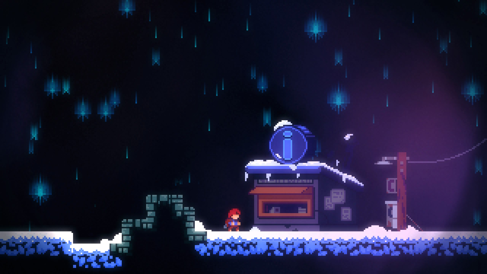
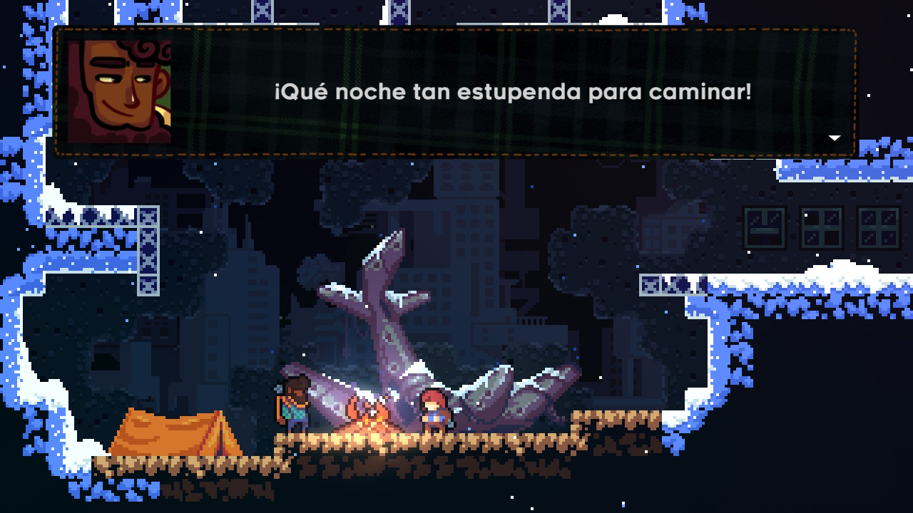
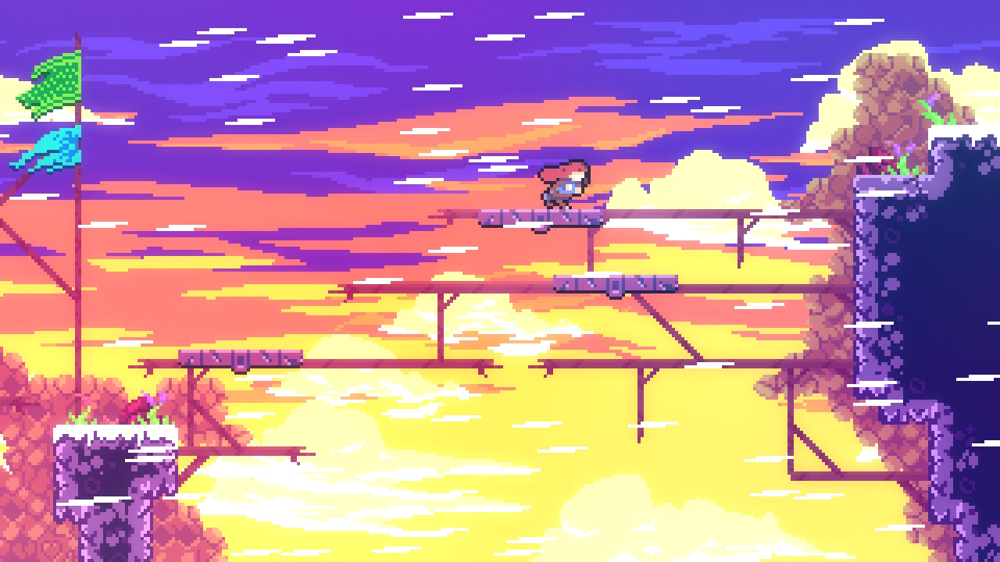
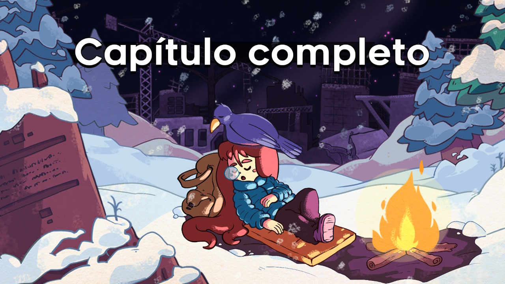

> Te recomiendo que escuches antes de nada [la banda sonora](https://radicaldreamland.bandcamp.com/album/celeste-original-soundtrack) de Celeste. Me lo agradeceras mientras lees esta pequeña reflexión.

  
  
  

En Celeste nos encontramos con la historia de Madeline, una buena moza que se ha propuesto escalar la monstaña Celeste y encontrar allí, en la medida de lo posible, respuesta a sus preguntas.

Y es que esta historia está plagada de emociones. Aunque para muchas personas el estilo _pixel-art_ puede estar considerado como algo carente de expresividad. Es innegable que Madeline a través de su ascenso nos mostrará, no sólo su mundo interior, sino que será capaz de transmitirnos su estado de ánimo, su desesperación y su alegría con tan sólo un puñado de píxeles.

Esto, acompañado de un gran diálogo con los diferentes personajes que nos iremos encontrando junto con su increíble banda sonora, compuesta por [Lena Raine](https://radicaldreamland.bandcamp.com/album/celeste-original-soundtrack), hacen que nos embarquemos en un viaje totalmente inmersivo debido a su dificultad, no es demasiado alta, pero sí lo suficiente para que tengamos que reintentar en varias ocasiones diferentes escenarios.

Hecho con mucho cariño por la gente de [Extremely OK Games](https://exok.com) durante una [game JAM](https://es.wikipedia.org/wiki/Game_jam). Sin duda, uno de los juegos que pondría dentro de mi lista de favoritos.
