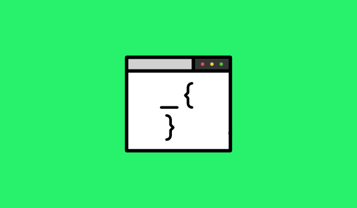

Con esta entrada, comienza lo que va a ser un pequeño resumen del primer curso del Ciclo Formativo de Grado Superior DAM (Desarrollo de Aplicaciones Multiplataforma) y todo lo que ofrece a lo largo del curso.

Hace unos meses, tomé la decisión de formarme como desarrollador en el IES Miguel Herrero de Pereda, en Torrelavega. El hecho de aunar las destrezas de ser diseñador gráfico y desarrollador me llamó mucho la atención, sobretodo porque, hoy en día, ambas pueden dar como resultado una gran autonomía a la hora de materializar ideas.

Uno de los problemas que vi es que, a la hora de elegir el ciclo, no encontraba toda la información que necesitaba para dar el paso definitivo. Al final, tuve que hacerlo un poco a ciegas. Como consecuencia, decidí crear este pequeño diario donde iré anotando ideas y, grosso modo, el temario del mismo.

Cabe decir que este ciclo comparte el mismo temario que el primer curso de DAW (Desarrollo de Aplicaciones Web) y que es totalmente compatible con DAM. Esto quiere decir que seremos capaces de sacarnos, en tres años, dos titulaciones.

Sin más, comienzo con lo más básico: las asignaturas. Explicaré, un poco, cómo nos las han presentado, cuál es su temario y qué cosas nos han ido enseñando durante el primer trimestre.

# Bases de datos

### 7 horas semanales

**Primeras semanas**

En principio, la asignatura se presenta interesante. Las primeras clases, las hemos ocupado presentando la asignatura, lo que veremos durante el primer año, cómo la evaluarán y cómo puntuará. Una vez terminada la bienvenida, hemos pasado a realizar diagramas de flujo con representaciones Entidad – Relación. Como software, estamos trabajando con Dia y DBDesigner. El primero nos ayudará a representar, de manera gráfica, los diagramas de flujo y, el segundo, lo utilizaremos para plasmar y diseñar esos mismos, en una base de datos.

**Final de trimestre**

Como conclusión del primer trimestre, los conocimientos adquiridos hasta aquí nos llevan a plantear una base de datos, organizándola mediante diagramas de flujo, asignando los valores correspondientes a cada dato y, teniendo en cuenta los tipos de consulta que se vayan a realizar, deducir su correcto funcionamiento mediante la asignación de claves principales, foreign-keys y demás datos que utilizaremos en DBDesigner. La siguiente evaluación la ocuparemos en consultas en MySQL mediante WampServer.

**Final de curso**

Con esta asignatura seremos capaces de crear nuestra base de datos compuesta por tablas relacionadas entre sí y con una arquitectura que puede contener:

1. Disparadores
2. Procedimientos
3. Eventos
4. Transacciones
5. Funciones

Junto a esto, seremos capaces de realizar búsquedas en nuestra base de datos de una forma eficaz mediante el uso de SELECT, restricciones y filtros. Seremos capaces de identificar nuestras tablas mediante claves únicas así como relacionarlas entre ellas con claves foráneas. Asignaremos los valores que creamos oportunos a cada campo y podremos insertar, modificar o eliminar datos. Todo ello desde la consola de nuestro gestor de MySQL. También aprenderemos a gestionar usuarios mediante PHPMyAdmin.

# Sistemas informáticos

### 7 horas semanales

**Primeras Semanas**

A primera vista, los primeros días hemos empezado a dar conceptos que yo no había visto en el instituto años atrás (cursé Bachillerato de Ciencias Sociales), como pueden ser fórmulas de calculo de intensidad, resistencia y voltaje de circuitos. No hay que ser diestro manejando matemáticas, pero sí tener presente que esto requiere refrescar conceptos básicos que pueden haberse olvidado. También veremos cómo representar y transformar números en base decimal, octal, binario y hexadecimal, entre ellos. La base más teórica se presenta con temas que abordan la memoria RAM, los microprocesadores, placas base, BIOS, comparativas…

**Final de trimestre**

El trimestre cierra con cinco temas donde el apartado de hardware tiene gran relevancia. Muchos de los datos que hemos visto son más bien de memorizar pero no dejan de ser útiles ya que aprenderemos cómo funciona un ordenador en términos de transmisión de la información (veremos como trabaja una CPU junto con la placa base, chipsets, memoria RAM) así como las diferentes piezas de hardware que existen hoy en día.

Junto con esta materia teórica, también hemos contado con clases prácticas donde hemos procedido al montaje de ordenadores, colocando diferentes piezas y comprobando, en la BIOS, que todo funciona como es debido.

**Final de curso**

Esta asignatura nos deja ver el qué y cómo se forma un ordenador. Hemos aprendido qué unidades forman la placa base, su lógica y su funcionamiento, hemos visto una parte del gran abanico de componentes que lo pueden formar de una forma específica y general al mismo tiempo.
irefox

# Programación (Java SE)

### 8 horas semanales

**Primeras semanas**

Podría decir que Programación es el tronco del ciclo o, al menos, durante el primer año, ya que es con la asignatura que más horas contamos a lo largo de la semana y con la que vamos a estar resolviendo problemas mediante código. En este caso, los primeros días hemos realizado una serie de ejercicios en Java bastante simples, que no me han dado ningún problema. Las siguientes semanas, hemos profundizado más en la creación de clases y bucles y, asimismo, en el Lenguaje Orientado a Objetos.

**Final de trimestre**

La conclusión del primer trimestre se traduce en una asignatura en la que, para aprobar, deberás practicar con muchos ejercicios de Java para conseguir cierta soltura a la hora de picar el código.

Como resumen, en este primer trimestre, nos han enseñado a diseñar pequeños programas que, si bien no son complicados, podrían considerarse como una de las bases para crear aplicaciones potentes; hablamos de conceptos como arrays, bucles (for, while), creación de clases, métodos y objetos. Como es lógico, también hemos aprendido la relación que hay entre este tipo de eventos, así como la manera que tienen de llamarse, declararse e instanciarse.

**Final de curso**

Esta asignatura servirá para introducirnos en un lenguaje complejo como puede ser Java. Esto significa que si queremos aprender otro lenguaje tendremos, en general, más facilidades a la hora de orientarnos a escribir con otro código ya que habremos aprendido a “hablar” en un idioma que sigue una lógica parecida.

En este primer curso no aprenderemos directamente a trabajar y crear aplicaciones Android (eso lo dejamos para el segundo) pero sí aprenderemos a implementar bases de datos y crear interfaces simples mediante el uso de librerías Swing. También implementaremos otro tipo de librerías como pueden ser de animación, manejo de ficheros, colecciones de objetos, lectura por teclado…

# Lenguajes de Marca y Sistemas de Gestión de la Información (LMSGI)

### 4 horas semanales

**Primeras semanas**

En esta asignatura, nos centraremos más en el terreno web pues, como su propio nombre indica, veremos lenguajes de marcado, uno en los que se basan la mayoría de páginas web. La asignatura en sí es sencilla. En nuestro caso hemos aprendido a dar estilo a textos, centrándonos en tablas, variaciones de estilo en las fuentes, llamadas internas y externas, y formularios.

**Final de trimestre**

El final del trimestre nos ha dejado con conocimientos varios, todos ellos dentro del terreno de html y css. Hemos aprendido a comprender la sintaxis del lenguaje html y su enlace con archivos css y la importancia de las hojas de estilo a la hora de diseñar y maquetar una web. También hemos visto cómo plantear formularios, tablas, listados así como metadatos que incluiremos en el head de nuestro html.

**Final de curso**

Esta asignatura nos enseñará los conceptos básicos de los lenguajes html y css así como del metalenguaje XML. Con html y css seremos capaces de crear nuestras primeras páginas web, todo ello desde cero, y así introducirnos en el mundo de la creación web.

Con el metalenguaje XML podremos ser capaces de organizar la información que deseemos, siempre dentro un orden y un determinado número de cláusulas.

# Entornos de Desarrollo

### 2 horas semanales

**Primeras semanas**

Una asignatura que, aunque cuenta con dos horas semanales, no es menos importante que las demás. Como su propio nombre indica, estudiaremos los entornos en los que vamos a desarrollar nuestras aplicaciones. En este caso Netbeans, nuestra IDE, con la que trabajaremos con Java.

**Final de trimestre**

La conclusión de estas clases se resume en el aprendizaje de la versatilidad del IDE Netbeans a la hora de trabajar. Hemos aprendido a cómo integrar librerías nuevas al programa, cómo crear proyectos que, no necesariamente, han de ser escritos en Java (podemos utilizarlo como editor html), hemos realizado depuración de código y comprendido la necesidad de utilizar JUnit para depurar nuestros proyectos.

**Final de curso**

Esta asignatura, aparentemente poco importante por el número de horas, nos enseña muchas claves a la hora de trabajar y ser más productivos. El mero hecho de aprender a usar programas Subversion o SVN es una clara prueba ello. Como conclusión final, esta asignatura no enseñará que a la hora de trabajar en grupo deberemos regir nuestro trabajo bajo una serie de normas y directrices para que nuestros proyectos maduren correctamente.

Aprenderemos a depurar código, organizarlo, simplificarlo y a refactorizarlo. Veremos cómo crear un buen manual de uso y mantenimiento de nuestro software y aprenderemos a rematar y dar un buen acabado a todo aquello que desarrollemos ya bien sea sólos o en grupo.

---

Todas las imágenes han sido obtenidas de [flaticon](https://flaticon.com)
