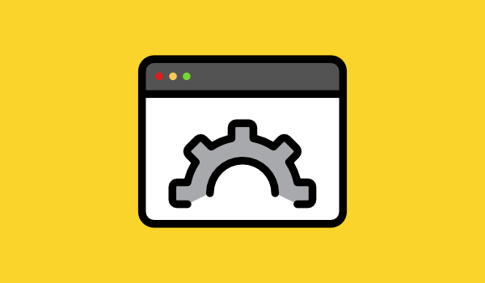
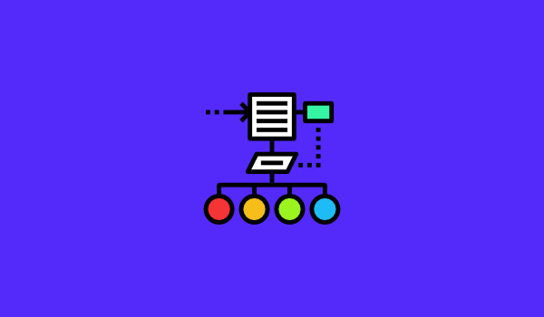
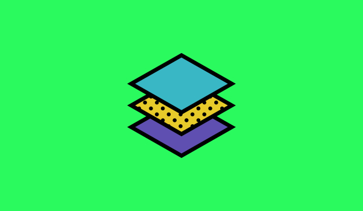

Aunque con algo de retraso, lanzo a la red la segunda parte de la crónica relativa al ciclo superior que he realizado. Hace cosa de un año, escribí esta entrada donde describía el primer año de “Desarrollo de aplicaciones multiplataforma”. Notarás que el post hace referencia a otra titulación; esto se debe a que a mitad de curso, decidí cambiar de disciplina puesto que encontraba que lo que iba a aprender me iba a resultar más útil que los contenidos de multiplataforma. No obstante, habrá también otra entrada del segundo ciclo de DAM escrita por compañeros del primer curso.

Aclarado esto, pretendo mostrar con esta entrada, grosso modo, lo que supone el segundo año del ciclo superior “Desarrollo de aplicaciones web”. Dejando de lado hacer una profundización exhaustiva en los temas, trataré las cuestiones que he encontrado dignas de mención para que, si en un futuro decides realizar el ciclo, veas lo que vas a tener entre las manos.

Comenzaré indicando las asignaturas y sus horas:

- **Desarrollo web en entorno servidor** 9 horas
- **Desarrollo web en entorno cliente** 9 horas
- **Despliegue de aplicaciones web** 4 horas
- **Diseño de interfaces web** 5 horas
- **Empresa e iniciativa emprendedora** 3 horas
- **Formación en centros de trabajo** 350 horas (varía)
- **Proyecto final de ciclo**

## Desarrollo web en entorno Servidor

Como bien dice su nombre, aprenderemos a desarrollar en un lenguaje que esté del lado del servidor. Esto quiere decir que nuestra programación se desarrollará, y sólo será visible, en un entorno donde un servidor ejecute su lógica. En mi caso el lenguaje elegido fue PHP, bastante famoso y con gran apoyo de la comunidad.

Gracias a la base aprendida en el primer curso, la adaptación a este lenguaje fue fácil y dinámica. Los primeros meses estuvieron dedicados a una iniciación rápida a PHP. Practicamos con formularios web, fechas, intercambio de datos entre el usuario y el servidor; aprendimos los tipos de arquitectura existentes, los lenguajes disponibles para desarrollar web… En definitiva, tratamos de adquirir soltura con el lenguaje mediante ejercicios sencillos de programación.

No fue hasta el segundo trimestre cuando entramos de lleno en la integración de Bases de Datos. Una vez que tuvimos nuestra cabeza amoldada al lenguaje, comenzamos a realizar pequeñas aplicaciones donde intercambiábamos información. Realizamos consultas e inserciones o modificamos datos para que, al final del trimestre, tuviéramos como resultado la clásica biblioteca / tienda ( ejercicio común en muchos ciclos ) en la que dispusiéramos de nuestra propia pantalla de login, formularios, logout, carrito de la compra… Como veis a continuación, estas son algunas de las capturas de mi aplicación web “El Colmenar”, una tienda de videojuegos sencilla y realizada en su totalidad en PHP y HTML.

Una vez terminada la etapa de iniciación al lenguaje y su uso con las bases de datos, llegó el momento de entrar en el terreno de los objetos. Aquí aprendimos (y repasamos) qué son los objetos, sus interfaces, cómo se ejecuta la herencia entre ellos, cómo podemos instanciarlos y modificarlos y, en definitiva, de qué manera podrían sernos útiles en nuestro trabajo.

Debido a que el segundo ciclo de Web es corto (6 meses), el temario es reducido y directo. Aprendimos cosas como patrones Modelo-Vista-Controlador, muy prácticos para entender las diferentes etapas de desarrollo que puede tener una aplicación, la integración con servicios web en aplicaciones, JAXAX y las librerías de PHP, la integración con JavaScript…; en resumen, lo suficiente como para tener un mínima base con la que practicar en la asignatura de FCT.

## Desarrollo web en entorno cliente

Si en el módulo de DWES desarrollábamos nuestra lógica del lado del servidor, esta vez tocaba hacerlo del lado del cliente. Esta asignatura está orientada a programación en Javascript integrándolo con Html.

De nuevo, durante las primeras semanas, la asignatura nos puso en el contexto de todo cuanto rodea al entorno cliente. Analizamos los lenguajes existentes, las estructuras básicas de desarrollo, las tecnologías disponibles… Es decir, preparamos el terreno para el grueso de la asignatura: Javascript.

Una vez aclarado todo, fue el momento de iniciar la ejecución de ejercicios sencillos (de cálculo, básicamente), con los que ir cogiendo soltura en las funciones básicas de JavaScript. Importante fue estudiar cómo depurarlas y visualizar el código, las posibilidades de uso del lenguaje, sus funciones predefinidas, los objetos y arras, entre otras cuestiones.

Al igual que en DWES, fuimos cogiendo soltura con el lenguaje para, después, dar paso al acceso Html (DOM), así como a la interacción con el navegador (BOM). Aprendida la base, comenzamos a jugar con la inserción y extracción de elementos en el DOM, ejecutando eventos que tuvieran que ver con el navegador y resumiendo todo el conjunto en pequeñas aplicaciones.

Cabe decir que, en mi caso, librerías externas como JQuery no se usaron a apenas. Bien es cierto que aprendimos el lenguaje de una manera pura, desde los de eventos, y las interacciones por ajax, así como la modificación de elementos en el DOM.

## Despliegue de aplicaciones web

Asignatura ligada a gestión y manejo de sistemas informáticos. Aquí conocimos y estudiamos todo lo relacionado con la creación de redes, configuración y gestión de servidores y despliegue de aplicaciones en diferentes entornos.

Cabe decir que esta asignatura está ligada a desarrollo web en entorno servidor, pues se trata de aquella en la que aprender el manejo de servidores y su configuración. A simple vista, parece algo que no está relacionado con el ciclo, sin embargo, según fuimos avanzando en la materia, descubrimos la importancia de la misma: los conocimientos en sistemas informáticos son totalmente necesarios a la hora de lidiar con nuestras aplicaciones.

Si bien a la hora de trabajar en una empresa, tendremos un departamento de IT que será el encargado de gestionar los servidores, no está de más conocer y manejar el contexto en el que nuestras aplicaciones se mueven, dónde están alojadas y cómo funciona el sistema que las sostiene.

En mi ciclo, seguimos a rajatabla el libro de DAW de la Editorial Garceta (en este enlace podrás consultar su temario), con el que fuimos poco a poco desplegando una red de servidores Linux y Windows bajo un MikroTik, a la vez que controlamos las conexiones entre ellos. Gestionamos el entorno de usuarios y el tipo de conexiones que existen entre los servidores; desplegamos un servidor Apache Tomcat donde lanzar una aplicación web; creamos y jugamos con DNS… Esto es, aprendimos a gestionar un servidor para extender nuestras aplicaciones.

## Diseño de interfaces web

Asignatura ligada a la parte más visual del desarrollo web. Aquí practicamos todo lo relacionado con html y css en relación al diseño de su interfaz. Ejercitamos también la gran cantidad de utilidades que existen, como los tipos de licencia existentes, las características para hacer que nuestra web sea más accesible, las formas de protitipado web…

Sin ser la asignatura más pesada del ciclo, estudiamos cuáles son las necesidades más básicas de una web para hacerla accesible y atractiva al público. Para ello, tratamos con imágenes, svg, png y todo aquello relacionado con la representación de gráficos, las diferentes formas de organizar la información, qué colores y tipografías son los más idóneos para que el usuario se sienta cómodo en nuestra aplicación web y demás cuestiones relacionadas.

Delimitaremos la asignatura en todo aquello que no sólo mejora el aspecto de nuestra web, si no que la dota de una valor más allá de lo estético, haciendo que nuestra web sea más usable.

## Empresa e iniciativa emprendedora

Asignatura común para todos los ciclos de grado superior. Durante el transcurso del año, fuimos preparando lo que se resume en un plan de empresa que presentar a final de curso (y una vez superado el módulo de FCT), junto a nuestro proyecto final de ciclo.

Esta asignatura fue aquella gracias a la cual conocimos cómo plantear una empresa desde los cimientos. Aprendimos de qué manera llevar a cabo la formación de nuestra sociedad, pasando por su desarrollo hasta llegar a su establecimiento (de una manera ficticia). El fin no era otro que simular la labor de empresarios (o emprendedores), defendiendo su viabilidad, junto a nuestra aplicación web.

## Formación en centros de trabajo y Proyecto final de ciclo

Por último, y siempre que estuvieran superados todos los módulos del ciclo (sin ser estrictamente necesario), da inicio lo que comúnmente conocemos como las prácticas y el desarrollo de nuestro proyecto final.

Aquí es donde cada alumno conocimos de primera mano un entorno real de trabajo y donde (supuestamente) desarrollamos las labores de desarrollador junior, empleando y aplicando todo lo aprendido en el ciclo.

Como es obvio, la experiencia de cada uno se verá supeditada al lugar donde realice las prácticas. Por mi caso, y por el de los que me rodearon, puedo decir que, en general, las experiencias siempre son satisfactorias y que, además, en varias ocasiones, las prácticas y el trabajo realizado en los centros laborales han hecho que muchos alumnos hayan conseguido un contrato.

A la par que se realizan las FCT, se desarrolla el culmen del curso: el trabajo de final de ciclo. Este consiste en una aplicación web donde aplicar e incluir todo lo aprendido hasta el momento. Tras finalizar las FCT, llega la prueba de fuego: defenderlo ante un tribunal junto con nuestro plan de empresa.

---

Todas las imágenes han sido obtenidas de [flaticon](https://flaticon.com)
