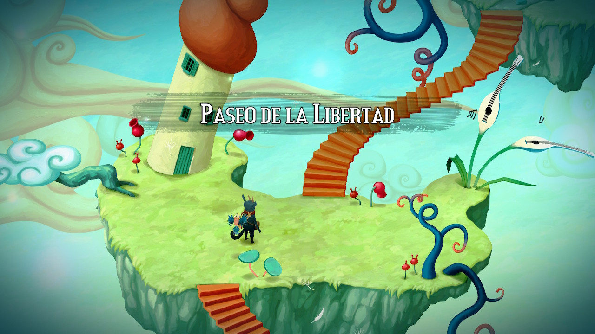
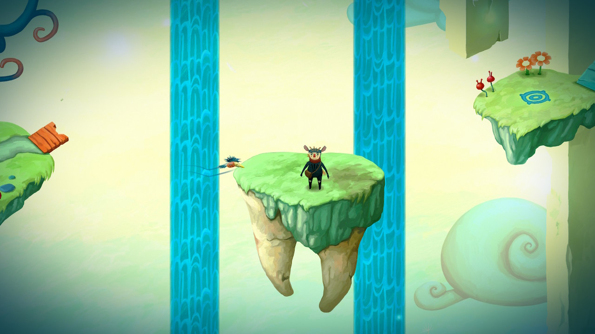
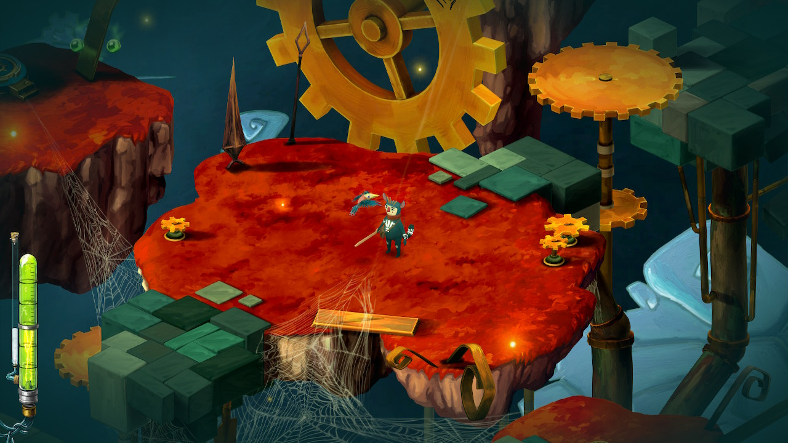
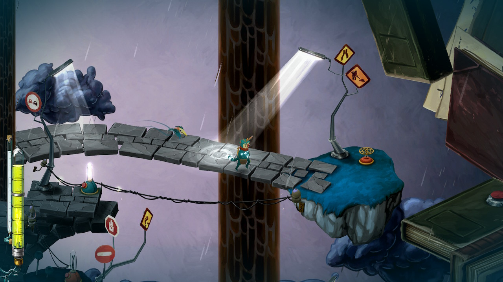

¿Qué es lo que le ocurre a nuestro cerebro cuando decide tomarse un respiro, aunque sea forzado? Esto es más o menos lo que Figment explora.

Un juego que **recorre diferentes estados de nuestro cerebro** tras un aparatoso accidente. A modo de aventura, iremos conociendo las diferentes zonas de nuestro córtex cerebral para resolver puzzle y acertijos que, entrelazados con nuestros recuerdos tratarán de hacer que nos levantemos del coma en el que estamos sometidos.

  
  
  

