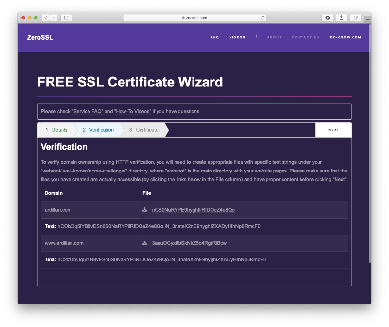
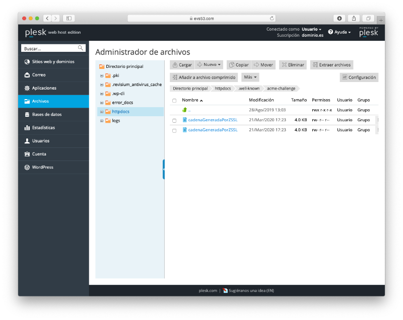
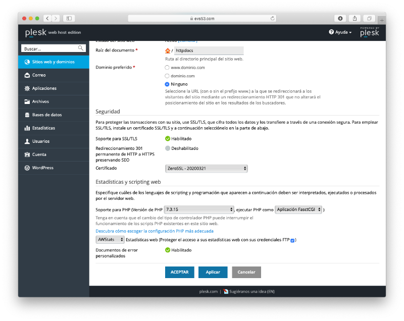

Hace unos meses estuve ayudando a un familiar a crear una web, a modo de blog, donde pudiera publicar todos los vídeos que hacía con su recién adquirido _drone_. Para ello estuvimos barajando diferentes opciones; no quería dejarse mucho dinero ya que simplemente necesitaba un espacio para subir un par de entradas al mes y poco más. Finalmente encontramos una solución barata que **parecía que cumplía** con todo lo necesario.

Digo parecía ya que el alojamiento que contratamos, el cual incluye un panel [Plesk](https://en.wikipedia.org/wiki/Plesk), no tenía la posibilidad de generar y añadir de manera automática un certificado SSL. Esto hizo que tuviese que indagar un poco en internet hasta encontrar la solución que necesitaba: **ZeroSSL**.

### ¿Cómo funciona?

ZeroSSL es una forma de **añadir un certificado SSL a tu página web**. La instalación es bastante fácil, para ello habrá que completar los siguientes pasos:

1. Crear los ficheros de verificación de domino.
2. Verificar que somos propietarios.
3. Añadir y seleccionar el certificado generado.

### 1. Crear los ficheros de verificación de domino

En primer lugar, necesitamos crear unos ficheros que servirán para verificar que somos los poseedores del dominio que vamos a proteger. Para ello podemos hacer clic en **"[FREE SSL Certificate Wizard](https://zerossl.com/free-ssl/#crt)"**. Desde ahí tendremos que completar los pasos que nos piden:

- Domain: www.midominio, dominio.com
- Aceptar las condiciones de uso

Una vez completado accederemos a una nueva pantalla donde podremos descargar dos archivos de texto (`.txt`) los cuales habrá que alojar en nuestro servidor.

### 2. Verificar que somos propietarios

Una vez generadas las claves deberemos verificar y dar notaría de que **el dominio que vamos a proteger es nuestro**. Para ello tendremos que crear una carpeta dentro de la raíz de nuestra web llamada `.well-known/acme-challenge/` e incluir los archivos dentro.

> **Nota:** No olvides eliminar la extensión `.txt` para que el enlace funcione correctamente.

### 3. Añadir el certificado generado

Por último, una vez generadas las claves, deberemos cargar los certificados para proteger correctamente nuestra web. En mi caso, al ser un panel de Plesk, he tenido seguir los siguientes pasos:

1. Acceder a la zona de "Certificados SSL/TLS"
2. Dentro, hacer clic en "Añadir certificado SSL/TLS"
3. Acto seguido "Cargar los archivos del certificado" con la clave privada y certificado
4. Por último, ir a "Configuración de hosting" y cargar el certificado generado

Una vez completados el proceso, no tendremos más que elegir el certificado que acabamos de configurar para proteger nuestro dominio.

Si has seguido bien todos los pasos, podrás acceder vía `https` a tu nuevo dominio protegido por Let's Encrypt. La única pega que tenemos en todo este proceso es que el certificado tiene una caducidad de tres meses, por lo que tendrás que generar uno nuevo en caso de que quieras seguir teniendo tu dominio protegido.

Si tienes más preguntas puedes consultar el apartado de "[Preguntas frecuentes](https://zerossl.com/ssl-faq.html)" de la web de ZeroSSL.
