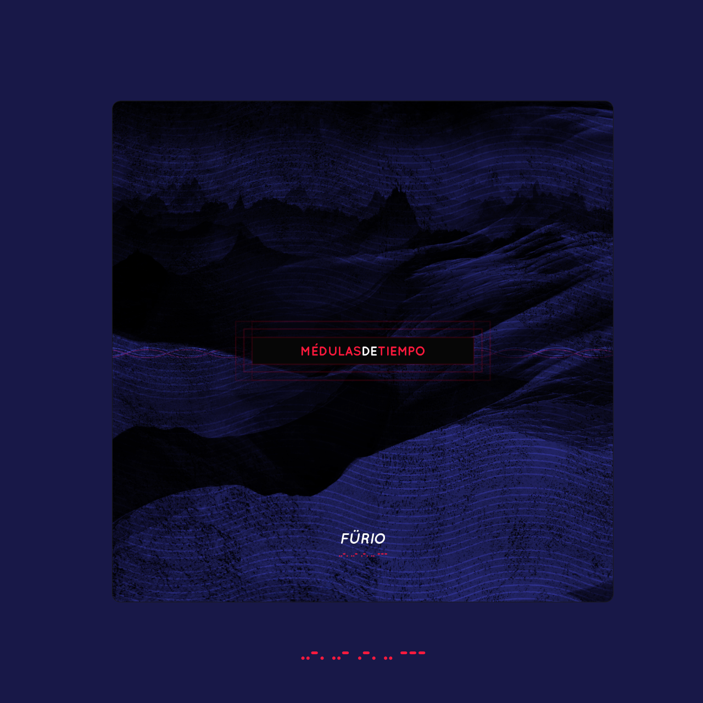
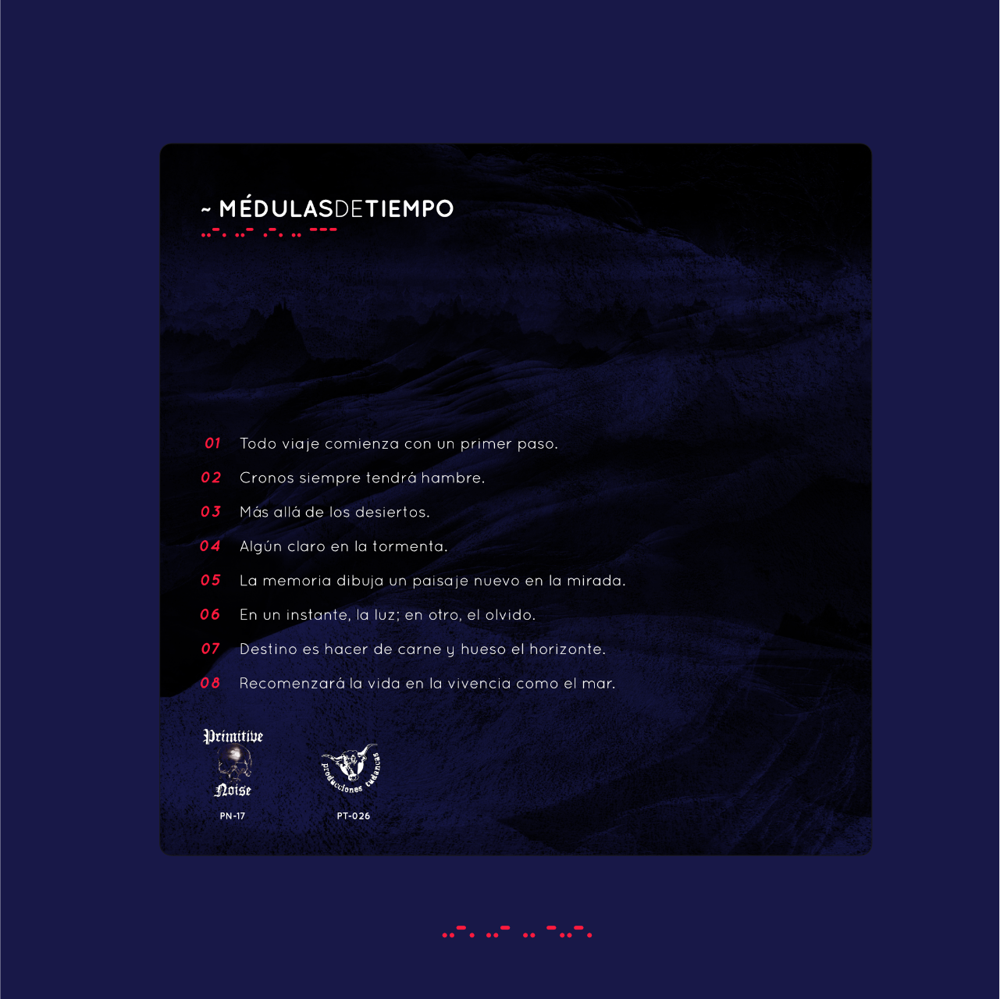
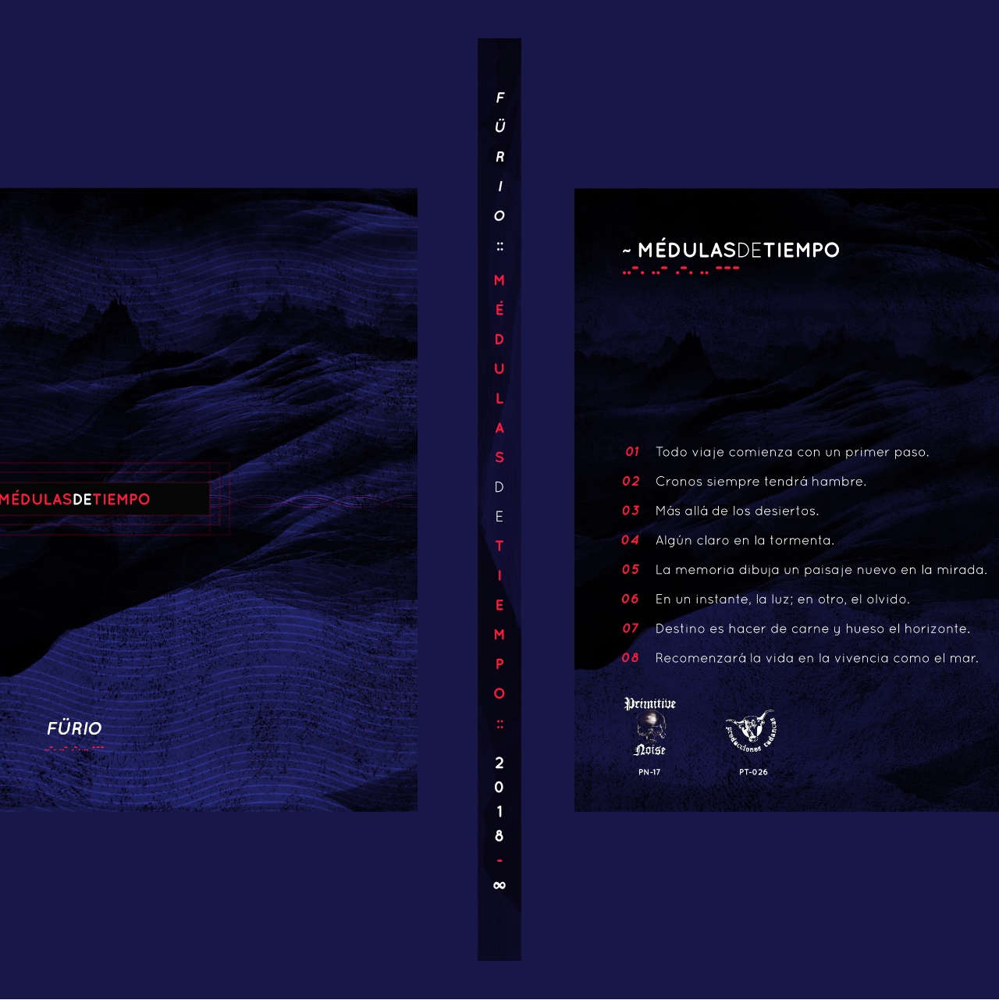
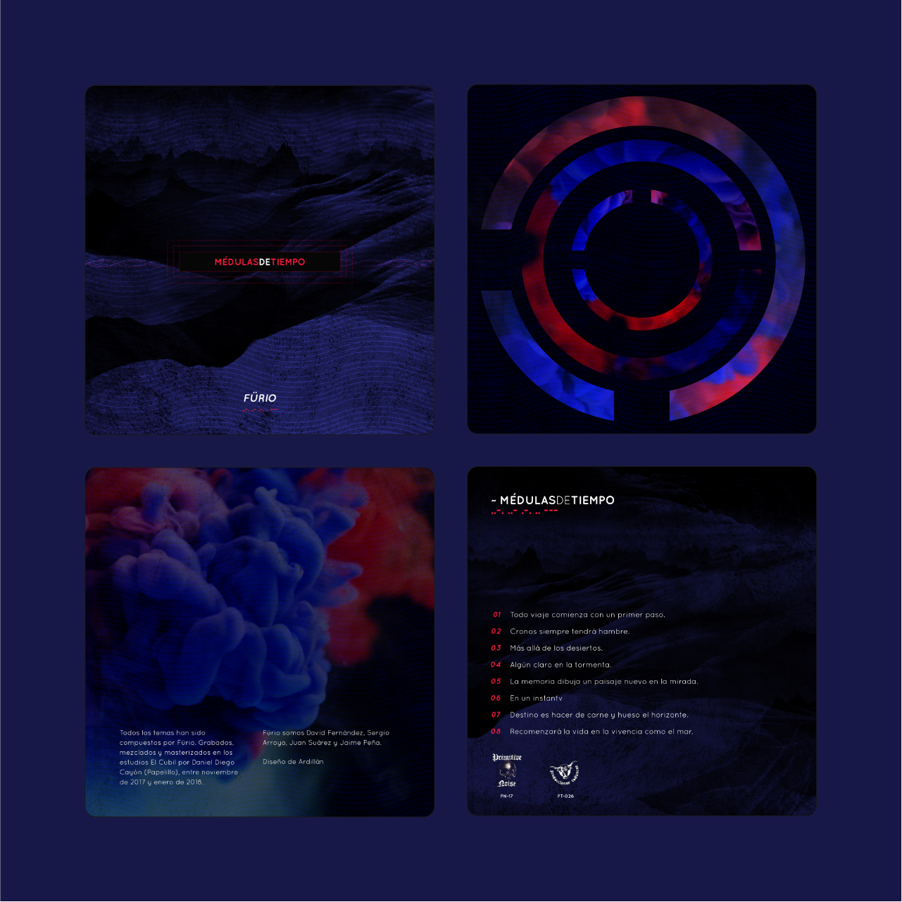

La banda de post-rock Fürio quería darle una imagen a su álbum "Médulas de tiempo". El diseño tenía muchas posibilidades ya que, al ser un disco con una temática abierta, no había límites ni directrices que tuviesen una definición clara.

Para ello, opté por utilizar diseños abstractos combinándolo con una tipografía simple pero clara.

  
  

  
  
  

