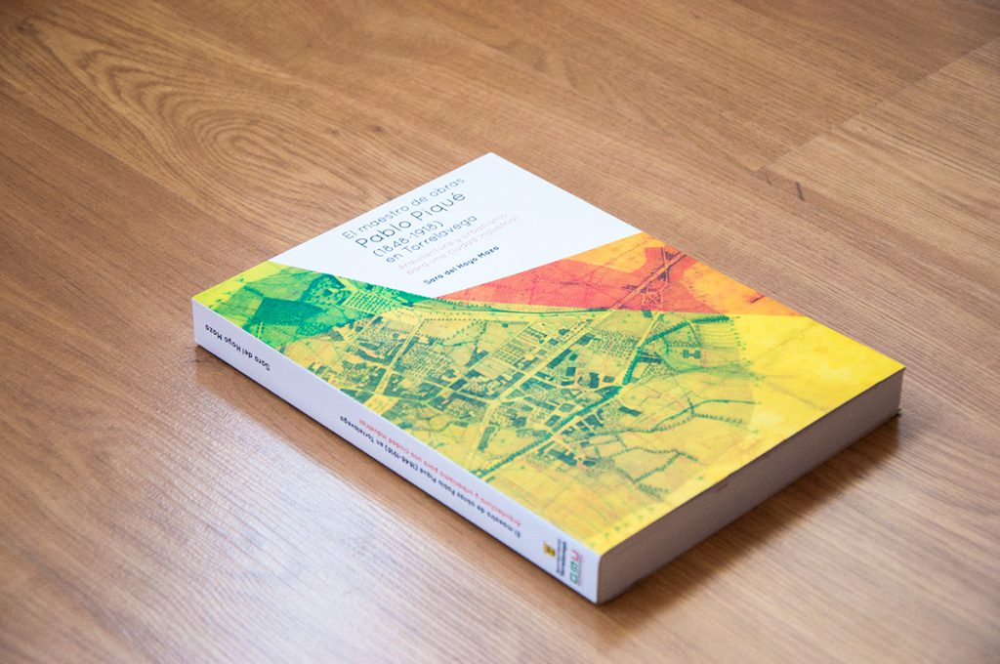

Diseño para el libro de "Pablo Piqué: Maestro de obras", de Sara del Hoyo Maza. El diseño está basado en uno de los planos originales con los que el maestro plasmó una nueva visión sobre la ciudad de Torrelavega.

  

