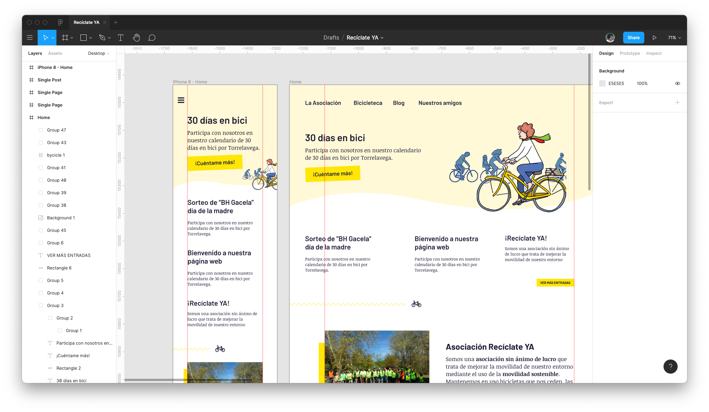
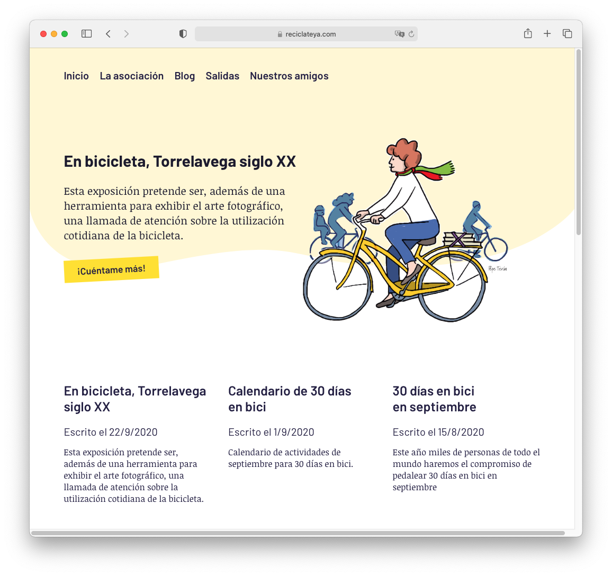

La Asociación [Recíclate Ya!](https://www.reciclateya.com) necesitaba una web que fuese útil y diese visibilidad al proyecto. Para ello vi decisivo que tenía que ser lugar donde la información estuviese lo más clara posible y que, además, gozase de una buena rapidez.

  

Para ello, utilicé [Figma](https://www.figma.com/) para plasmar el diseño y [Frontity](https://www.frontity.com/) para el desarrollo. Nunca había trabajado con la herramienta, pero el resultado ha sido maravillo, pudiendo disponer de una web agradable tanto en el aspecto visual como en la experiencia de usuario.

  

