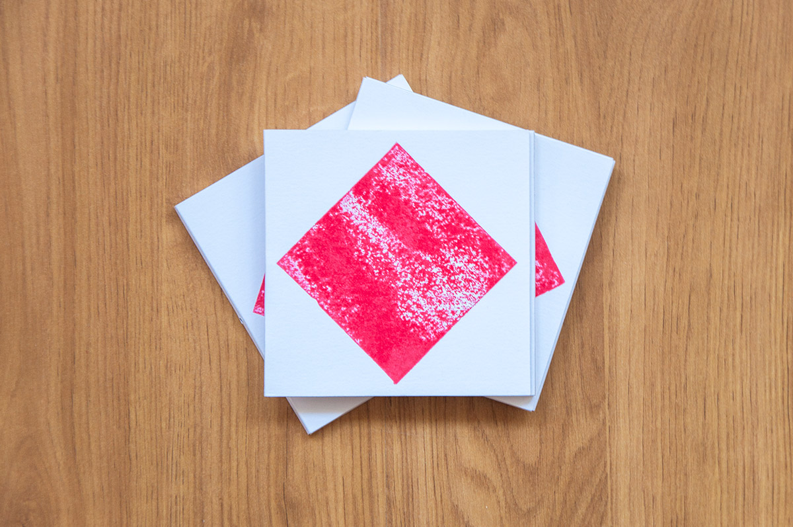
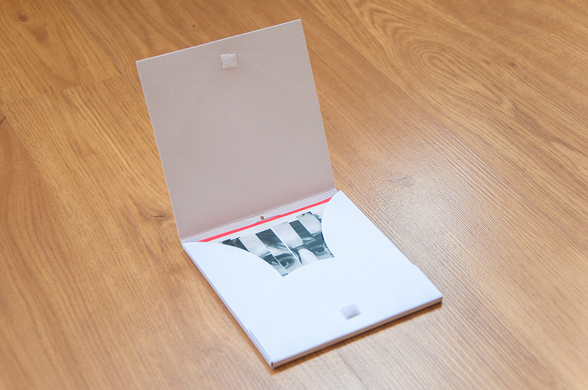

Diseño y edición artesanal para la banda The Room, un dúo guitarra-batería instrumental de Torrelavega. El disco está hecho artesanalmente, la portada es un sello con un cuadrado que representa a la banda. Cada disco tiene su propio patrón único.

Si lo deseas, puedes escuchar el disco en su [Bandcamp](https://somostheroom.bandcamp.com/album/tom-s)

  
  
  
  
  

