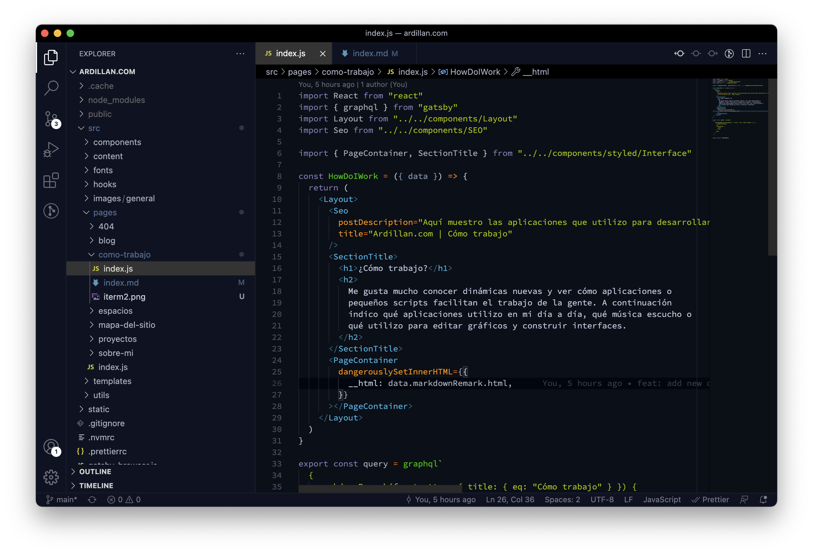
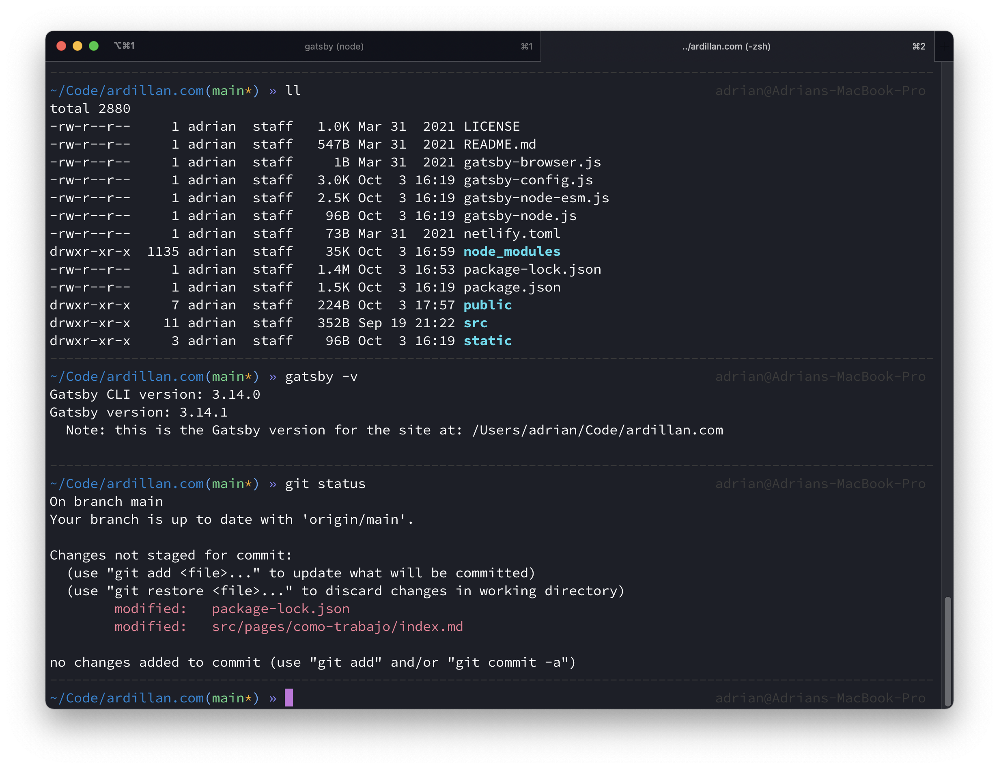

##### Sistema operativo

Utilizo un **Macbook Pro M1** de 2020. Vengo utilizando equipos de Apple desde 2008. Me encuentro muy cómodo trabajando con macOS. Ahora plataformas como Windows y GNU/Linux han mejorado muchísimo, por lo que siempre estoy abierto a probar nuevos sistemas.

##### Comunicación

Para **comunicarme** día a día confío en **Telegram** y **Slack**. Ambos me encantan aunque, si tengo que elegir, es Slack donde más cómodo me siento, sobretodo para cuestiones de trabajo.

##### Visual Studio Code

Para desarrollar utilizo [Visual Studio Code](https://code.visualstudio.com/). He probado Sublime, Atom, Brackets y algún que otro IDE. Éste por ahora es mi favorito por su velocidad, integración con git y la facilidad de añadir una configuración personalizada para editar código.



Además de [utilizar un icono de escritorio](https://github.com/dhanishgajjar/vscode-icons) diferente, también personalizo el editor con la siguiente configuración:

```json
{
  // Tema
  "workbench.colorTheme": "FireFly Pro",
  // Fuente y ligaduras
  "editor.fontFamily": "'Source Code Pro for POWERLINE', 'monospace'",
  "editor.fontSize": 13,
  "editor.lineHeight": 18,
  "editor.fontLigatures": true,
  // Mostrar reglas
  "editor.renderIndentGuides": true,
  "editor.rulers": [80, 120],
  // Prettier
  "editor.formatOnSave": true,
  "[javascript]": {
    "editor.defaultFormatter": "esbenp.prettier-vscode"
  },
  "[html]": {
    "editor.defaultFormatter": "esbenp.prettier-vscode"
  },
  "workbench.editorAssociations": {
    "git-rebase-todo": "default"
  }
}
```

##### iTerm 2

Como terminal siempre uso [iTerm2](https://www.iterm2.com/). No soy un usuario avanzado, pero me gusta mucho poder configurarlo a mi gusto y aprovechar las características que trae.



Mi configuración para la terminal es la siguiente:

- Utilizo [zsh](https://ohmyz.sh/) como framework
- El tema que utilizo es [af-magic](https://github.com/andyfleming/oh-my-zsh/blob/master/themes/af-magic.zsh-theme)
- La fuente es "[Source Code Pro](https://github.com/powerline/fonts/tree/master/SourceCodePro)"
- La configuración de color es [Lovelace](https://github.com/mbadolato/iTerm2-Color-Schemes#lovelace).

##### Gráficos

Para montar un **flujo de pantallas** y diseñar interfaces utilizo ~~Photoshop~~, ~~Affinity Designer~~, ~~Sketch App~~, [Figma](https://www.figma.com/).

Si necesito **editar vectores** utilizo [Affinity Designer](https://affinity.serif.com/es/designer/), en cambio para **fotografías** utilizo [Affinity Photo](https://affinity.serif.com/es/photo/). Ambas aplicaciones están desarrolladas por Serif, por lo que la integración entre ellas es total.

##### Notas

Para pequeñas listas _to-do_ siempre me gusta echar mano de [Clear](https://itunes.apple.com/us/app/clear-tasks-reminders-to-do-lists/id504544917?mt=12). Una aplicación súper rápida que sirve para tomar notas.

Si lo que necesito es tomar notas con más detalle o compartir ideas, utilizo [Notion](https://www.notion.so/).

##### Música

Siempre trabajo con música de fondo. Como cada situación y momento del día es muy diferente la música que suena siempre varía. No obstante estos son algunos de los discos que reproduzco a menudo en mi ordenador.

- [Jaga Jazzist](https://jagajazzist.bandcamp.com/)
- [Baiuca](https://raso.bandcamp.com/album/baiuca-solpor)
- [The Mercury Program](https://themercuryprogram.bandcamp.com/)
- [Viva Belgrado](https://vivabelgrado.bandcamp.com/album/flores-carne)
- [Totorro](https://totorro.bandcamp.com/album/come-to-mexico)
- [Mouse on the keys](https://motk.bandcamp.com/album/tres)
- [A wilhelm scream](https://jumpstartrecords.bandcamp.com/album/career-suicide)
- [Maseratti](https://maserati.bandcamp.com/album/passages)
- [And So I Watch You From Afar](https://asiwyfa.bandcamp.com/)
- [Poké&Chill](https://music.gamechops.com/album/pok-chill)

También tengo listas de reproducción creadas por mí que tocan muchos estilos. Por ejemplo mi [lista de Epixelia](https://itunes.apple.com/es/playlist/epixelia/pl.u-BNA6rgWCpXPK5z) donde se oyen canciones de videojuegos, o la [lista de Novecientos](https://itunes.apple.com/es/playlist/novecientos/pl.u-leyl1XRCxZ3y0L) donde suenan canciones de diferentes estilos, o incluso mi lista de [Waltasia](https://itunes.apple.com/es/playlist/waltasia/pl.u-6mo448etZkj7EP) que dejo que descubras por tí mismo.

##### Podcast

Siempre me gusta escuchar programas donde hablan de tecnología o videojuegos. Esta sería la lista de mis podcast favoritos.

- [No me da la vida](https://anchor.fm/no-me-da-la-vida)
- [Loop Infinito](https://www.applesfera.com/applesfera-podcast/bienvenidos-a-loop-infinito-nuevo-podcast-applesfera)
- [CODEC](https://podtail.com/en/podcast/codec/)
- [El Arroyo Dev](https://elarroyo.dev/)
- [Gadgetocast](https://redllenando.com/gadgetocast/)
- [Un billete a Chattanooga](https://unbilleteachattanooga.com/)
- [El Complejo Lambda](https://www.complejolambda.com)
- [Mundo Babel](https://www.rtve.es/play/audios/mundo-babel/)
- [Podcast Replay](https://www.podcastreplay.com)
- [Mixx.io](https://mixx.io/)
- [Kernel](https://mixx.io/kernel)
